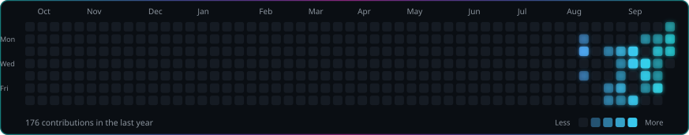

  

  <b>Computer Engineering</b> at <b>Inatel</b> &#183; 6th period

  

<h2 align="center">&#128736;&#65039; Stack</h2>

  
  
  
  
  
  
  
  

  
  
  
  
  
  
  
  
  
  
  
  
  

<h2 align="center">&#128202; Activity</h2>

  

  

